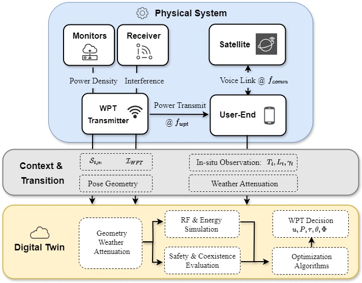

# Digital Twin for WPT-Enabled NTN Voice

This repository implements a **closed-loop digital twin (DT)** that co-schedules **wireless power transfer (WPT)** and narrowband uplink voice in non-terrestrial networks (NTN). The controller remains **energy-neutral** while enforcing standardized **safety and coexistence constraints** (exposure, interference, pre-decoding SINR, latency, device temperature) under time-varying geometry and rain attenuation.


<sub>System diagram: physical system → measurements/compliance → context fusion → DT prediction & optimization → WPT actuation (on/off, power, duty, steering/RIS).</sub>

## Features
- Energy-neutral WPT scheduling with communication coexistence.
- Hard constraints: exposure \(S\), interference \(I\), SINR \(\gamma\), latency \(L\), temperature \(T\).
- Lightweight baselines and stronger controllers (windowing, quota-guided, feasibility-screened grid search, binary block scheduling).
- Reproducible plots: time series, sensitivity, robustness, cost.

## Quick Start
```bash
python scripts/time_series.py
```

### Github Page Demo
- https://messsiaen.github.io/digital_twin/